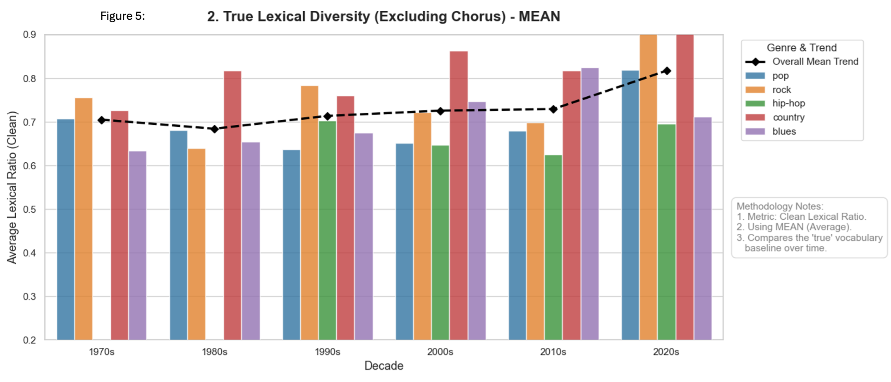
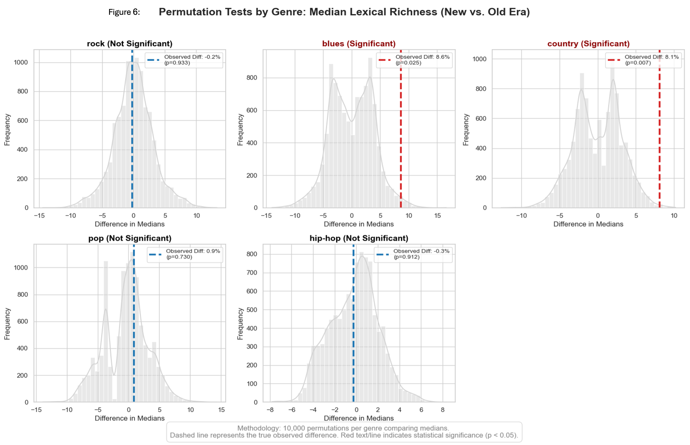
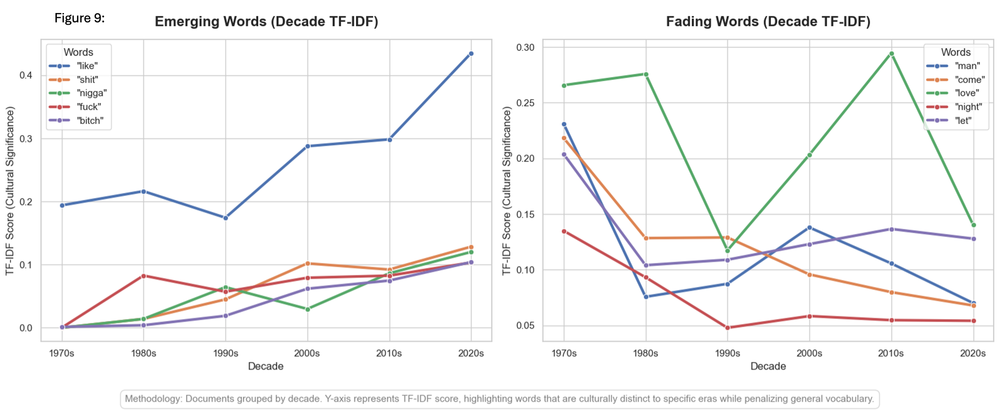
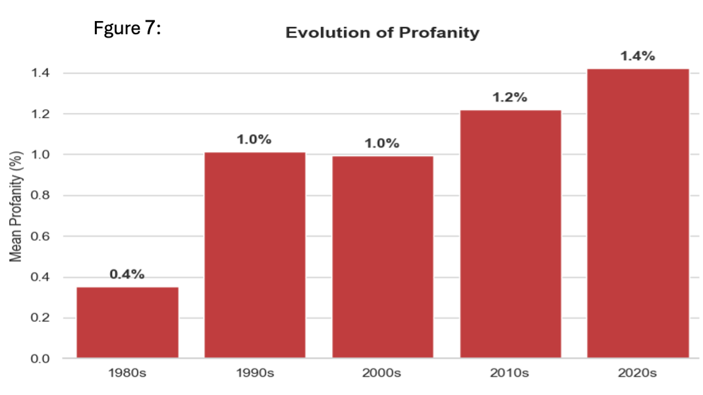

<p align="center">
  
</p>

# 🎵 Lyric Evolution Across Decades: Are Songs Getting Simpler?

<!-- Badges Section -->
<p align="center">
  
  
  
  
</p>

---

> ### 💡 The Core Question & Key Takeaway
> **Did song lyrics actually become simpler or lower in quality over the last decades?**  
> **The Short Answer:** Not overall. While repetitive structures exist in modern music, our data shows no statistical decline in lyrical complexity across decades. However, specific genres (like *Blues* and *Country*) actually show a significant increase in lexical richness over time.

---

## 📑 Table of Contents
<details>
<summary><b>Click to expand Table of Contents</b></summary>

- [Overview](#overview)
- [Team Members](#team-members)
- [Dataset Description](#dataset-description)
- [Primary Variables](#primary-variables)
- [Data Cleaning & Preprocessing](#data-cleaning--preprocessing)
- [Key Findings](#key-findings)
  - [1. Overall Lyric Quality & Lexical Richness](#1-overall-lyric-quality--lexical-richness)
  - [2. Lexical Dynamics: The Rise and Fall of Words](#2-lexical-dynamics-the-rise-and-fall-of-words)
  - [3. Cultural Shifts & Profanity Evolution](#3-cultural-shifts--profanity-evolution)
  - [4. AI & Large Language Model (LLM) Detection](#4-ai--large-language-model-llm-detection)
- [Full Data Dictionary](#full-data-dictionary)
- [Repository Structure](#repository-structure)
- [Quickstart & Reproducibility](#quickstart--reproducibility)
</details>


## Overview
This repository contains the Data Science final project for course **71253** at **The Hebrew University of Jerusalem**. 

Using **Exploratory Data Analysis (EDA)** and **Natural Language Processing (NLP)** techniques—including lexical richness metrics, profanity evolution tracking, and decade-level TF-IDF analysis—we analyze trends in lyric complexity, vocabulary trajectories, and the potential presence of AI/LLM influences in modern music.

---

<a name="team-members"></a>
## 👥 Team Members
* **Geva Weiss**
* **Amit Schraub**

---
---

## Dataset Description
* **Source:** [Genius.com](https://genius.com/)
* **Data:** [Data Set](Data/final_genius_enriched_songs_by_dacades_patched.csv)
* **Records:** [785](#records)
* **Variables:** [25](#full-data-dictionary)

### Primary Variables
* `song_title` – Title of the track
* `artist_name` – Performing artist or group
* `release_year` / `decade` – Release year and binned decade
* `genre` – Musical genre classification (e.g., Rock, Blues, Country, Hip-Hop)
* `nique_ratio_no_repeated_chorus` – Core Lexical Diversity Metric: The ratio of unique words to total words no stop-words and without repeated chours (closer to 1 = highly diverse, closer to 0 = highly repetitive).
* `total_word_count` – Total word count per song
* `profanity_ratio` – Frequency of profane terms per track

### Data Cleaning & Preprocessing
* Handled missing values in lyric metadata.
* Cleaned stop words, punctuation, and standardized text formatting.
* Conducted lemmatization and aggregated lyrics by decade corpora for TF-IDF tracking.

---

<a name="key-findings"></a>
## 📊 Key Findings

### 1. Overall Lyric Quality & Lexical Richness
- **No Overall Decline:** No statistical evidence indicates a general decline in song lyric quality or complexity over the past decades.
- **Genre-Specific Shifts:** A statistically significant increase in lexical richness was observed in specific genres (such as *Blues* and *Country*) across decade periods.
- **Permutation Test:** To validate these shifts, we performed a permutation test on the median lexical richness across genres.

<p align="center">
  
</p>

<p align="center">
  
</p>

---

### 2. Lexical Dynamics: The Rise and Fall of Words
- **Song vs. Era Vocabulary:** Binary occurrence metrics (word presence per song) vs. decade-level TF-IDF metrics revealed distinct differences between within-song repetition and overall era vocabulary.
- **TF-IDF Formula:** We calculated term importance using standard TF-IDF weighting across decades:

<p align="center">
  
</p>

- **Emerging & Fading Terms:** We tracked specific "Emerging Words" that surged during particular decades and subsequently faded.

<p align="center">
  
</p>

---

### 3. Cultural Shifts & Profanity Evolution
- **Upward Trend:** Identified a clear upward trend in profanity across decades, strongly aligned with the rise of Hip-Hop culture and its mainstream influence.

<p align="center">
  
</p>

---

### 4. AI & Large Language Model (LLM) Detection
- **No AI Influence Detected:** We found no empirical evidence of LLM usage or stylistic adoption among songwriters in recent years.
- **Domain Mismatch:** Benchmark LLM wordlists (typically compiled from scientific literature) show a clear domain mismatch when applied to poetic and creative lyrics.
- **The "Fresh" Effect (Outlier Case Study):** 
  Our initial analysis flagged a potential spike in "AI-like" vocabulary in modern songs. However, deeper investigation revealed a severe **sample bias driven by a single word: *"fresh"***. 
  
  Because *"fresh"* appears heavily in benchmark LLM wordlists as well as in specific song titles/choruses, it artificially inflated the LLM similarity score. Once isolated and normalized, the apparent trend completely vanished—confirming that the observed spike was merely an outlier artefact rather than genuine AI influence.


---

<a name="full-data-dictionary"></a>
## 📋 Full Data Dictionary

This table describes all 25 features available in the final enriched dataset, divided into logical categories: Metadata, Popularity Targets, Song Structure, and Linguistics/NLP.

<details>
<summary><b>👉 Click here to expand the Data Dictionary (25 Variables)</b></summary>

<br>

| Feature Name | Category | Data Type | Description |
|---|---|---|---|
| `song_title` | Metadata | String | The exact title of the song as listed on Genius. |
| `artist_name` | Metadata | String | The name of the primary performing artist. |
| `release_year` | Metadata | Integer | The official release year of the song. |
| `decade` | Metadata | Categorical | The specific decade the song belongs to (e.g., 1990s, 2010s). |
| `genre` / `primary_tag` | Metadata | Categorical | The primary genre of the song (Pop, Rock, Hip-Hop, Country, Blues). |
| `source_url` | Metadata | String | A direct URL to the song's page on Genius. |
| `featured_artists_count` | Metadata | Integer | The number of guest artists (features) on the track. |
| `pageviews` | Popularity (Target) | Integer | Total pageviews for the song's lyrics on Genius. |
| `pyongs_count` | Popularity (Target) | Integer | Upvotes ("Pyongs") from the Genius community. |
| `lyrics` | Structure | String | The full, raw text of the song's lyrics. |
| `total_word_count` | Structure | Integer | Total words in the song, excluding punctuation and meta-tags. |
| `count_chorus` | Structure | Integer | Number of times a chorus (or pre-chorus) section appears. |
| `count_verse` | Structure | Integer | Number of verse sections in the song. |
| `count_intro` | Structure | Integer | Number of intro sections identified. |
| `count_bridge` | Structure | Integer | Number of bridge sections identified. |
| `unique_special_word` | Linguistics (NLP) | Integer | Count of words excluding common stop-words and repetitive words. |
| `special_word_without_chorus` | Linguistics (NLP) | Integer | Special word count where repeated chorus sections are counted only *once*. |
| `unique_ratio_no_repeated_chorus` | Linguistics (NLP) | Float (Ratio) | **Core Metric:** Unique to total words without stop-words and chorus repetition. |
| `special_words_ratio` | Linguistics (NLP) | Float (Ratio) | Standard lexical diversity ratio (before chorus normalization). |
| `profanity_count` | Linguistics (NLP) | Integer | Total occurrences of explicit language. |
| `profanity_ratio` | Linguistics (NLP) | Float (Ratio) | Percentage of explicit words relative to total word count. |
| `adjectives_count` | Linguistics (NLP) | Integer | Total count of adjectives identified using POS tagging. |
| `adjectives_ratio` | Linguistics (NLP) | Float (Ratio) | Percentage of adjectives relative to total word count. |

</details>

## Records:


---

<a name="repository-structure"></a>
## 📁 Repository Structure

```text
├── Data/                   # Raw and processed datasets (including LLM wordlists & song lyrics)
├── Figures/                # High-resolution plots, charts, and Jupyter Notebooks for visualizations
├── Project/                # Final PDF report and presentation materials
├── code/                   # Python scripts for data cleaning, preprocessing, and NLP calculations
├── requirements.txt        # Python package dependencies
└── README.md               # Project documentation
```

---

<a name="quickstart--reproducibility"></a>
## 🚀 Quickstart & Reproducibility

Follow these steps to set up the environment and run the code on your local machine:

### 1. Clone the Repository
Open your terminal / command prompt and run:
```bash
git clone https://github.com/gevaweiss/data-science-project.git
cd data-science-project
